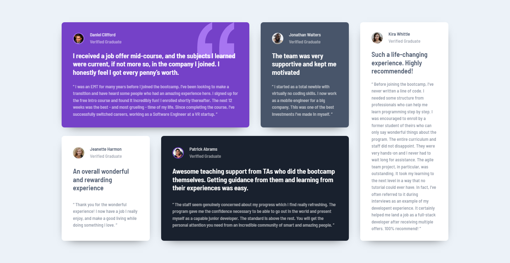

# Frontend Mentor - Testimonials grid section solution

This is a solution to the [Testimonials grid section challenge on Frontend Mentor](https://www.frontendmentor.io/challenges/testimonials-grid-section-Nnw6J7Un7). Frontend Mentor challenges help you improve your coding skills by building realistic projects. 

## Table of contents

- [Overview](#overview)
  - [The challenge](#the-challenge)
  - [Screenshot](#screenshot)
  - [Links](#links)
- [My process](#my-process)
  - [Built with](#built-with)
  - [What I learned](#what-i-learned)
  - [Continued development](#continued-development)
  - [Useful resources](#useful-resources)
- [Author](#author)

## Overview

### The challenge

Users should be able to:

- View the optimal layout for the site depending on their device's screen size

### Screenshot



### Links

- Solution URL: [Solution](https://github.com/JustANipple/testimonials-grid-section/blob/master/style.css)
- Live Site URL: [Live site](https://justanipple.github.io/testimonials-grid-section/)

## My process

### Built with

- Semantic HTML5 markup
- CSS custom properties
- Flexbox
- CSS Grid
- Mobile-first workflow
- Josh's Custom CSS Reset

### What I learned

I was looking for different spacing between blocks in a grid and i discovered that i can have a row gap and a column gap. That's what i used for my grid spacing in desktop view

Here is my different grid gaps:

```css
.container {
  padding: 1.5rem;
  margin: 3rem 0;
  display: grid;
  row-gap: 1.5rem;
  column-gap: 2rem;
}
```

### Continued development

I've never used EMs in my project, but it looks like is a powerful and useful technique to make sites more responsive. I am going to find a way to use them

### Useful resources

- [Grid gaps](https://developer.mozilla.org/en-US/docs/Glossary/Gutters) - This made possible to have vertical spacing different from the horizontal one

## Author

- Frontend Mentor - [@JustANipple](https://www.frontendmentor.io/profile/JustANipple)
